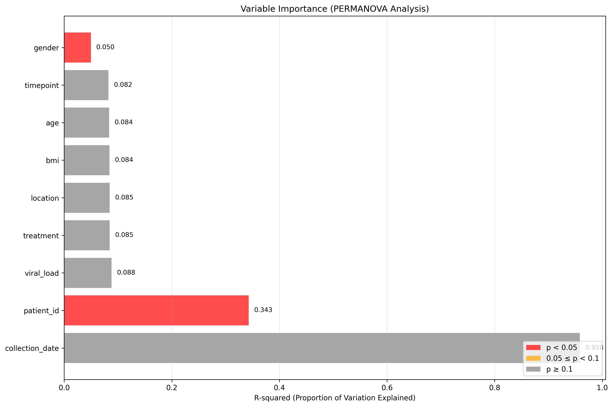
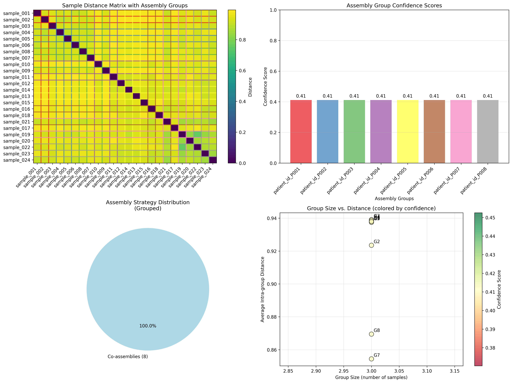

# MetaGrouper

<p align="center">
  
</p>

[](https://www.python.org/downloads/)
[](https://opensource.org/licenses/MIT)

**MetaGrouper** analyzes metagenomic samples and recommends optimal assembly strategies based on k-mer composition similarity and metadata analysis.

## Key Features

- 🧬 **K-mer profiling** with fast sourmash MinHash sketching
- 📊 **Smart metadata filtering** focuses on biologically relevant variables
- 🎯 **Assembly recommendations** with ready-to-run commands
- 📈 **Interactive HTML reports** with dynamic visualizations
- ⚡ **Memory-efficient** processing for large datasets
- 🔧 **Multi-assembler support** (MEGAHIT, SPAdes, Flye)

## Recent Improvements

- **10x higher sensitivity** with optimized sourmash parameters
- **Smart metadata filtering** automatically focuses on biological variables
- **Sample name normalization** handles common preprocessing suffixes
- **Interactive HTML reports** with dynamic visualizations
- **Performance optimizations** for large datasets

## Quick Start

### Installation

```bash
# Clone repository
git clone https://github.com/megjohnson1999/metaGrouper.git
cd metaGrouper

# Install with conda (recommended)
conda env create -f env.yaml
conda activate metagrouper

# Test installation
python metagrouper.py --help
```

### Basic Usage

```bash
# Simple analysis
python metagrouper.py /path/to/fastq/files -o results/

# With metadata and assembly recommendations
python metagrouper.py /path/to/fastq/files \
    --metadata samples_metadata.csv \
    --auto-filter-variables \
    --assembly-tools megahit spades \
    --comprehensive-report \
    --output results/
```

## Input Requirements

- **FASTQ files**: Single or paired-end reads (`.fastq`, `.fq`, gzipped supported)
- **Metadata file** (optional): CSV with sample information and experimental variables

Sample IDs must match FASTQ filenames. MetaGrouper automatically handles common preprocessing suffixes and filters technical variables.

## Key Options

- `--metadata` - CSV file with sample information
- `--auto-filter-variables` - Focus on biological variables automatically
- `--assembly-tools` - Assembly tools: `megahit`, `spades`, `flye`
- `--comprehensive-report` - Generate interactive HTML report
- `--similarity-threshold` - Sample grouping threshold (default: 0.45)

See `python metagrouper.py --help` for all options.

## Output Files

- **Core results**: Distance matrix, PCA plots, similarity heatmaps
- **Metadata analysis**: Statistical test results, variable filtering reports
- **Assembly recommendations**: Strategy summaries and ready-to-run shell scripts
- **Interactive report**: `interactive_report.html` with dynamic visualizations

## Example Output

### Sample Similarity Analysis


*Distance heatmap showing sample similarities (left) and PCA visualization of k-mer profiles (right)*

### Metadata Association Testing


*PERMANOVA results showing which metadata variables significantly explain sample composition differences*

### Assembly Strategy Recommendations


*Comprehensive assembly strategy overview with grouping decisions and confidence scores*

## Documentation

📚 **[Complete Tutorial](TUTORIAL.md)** - Comprehensive guide with examples, parameter explanations, and troubleshooting

## Getting Help

- 🐛 **Issues**: [GitHub Issues](https://github.com/megjohnson1999/metaGrouper/issues)
- 💬 **Discussions**: [GitHub Discussions](https://github.com/megjohnson1999/metaGrouper/discussions)

## License

MIT License - see [LICENSE](LICENSE) file for details.

## Acknowledgments

- Built with scikit-learn, pandas, matplotlib, and sourmash
- Thanks to the sourmash team for fast MinHash implementation
- Thanks to all contributors and beta testers
